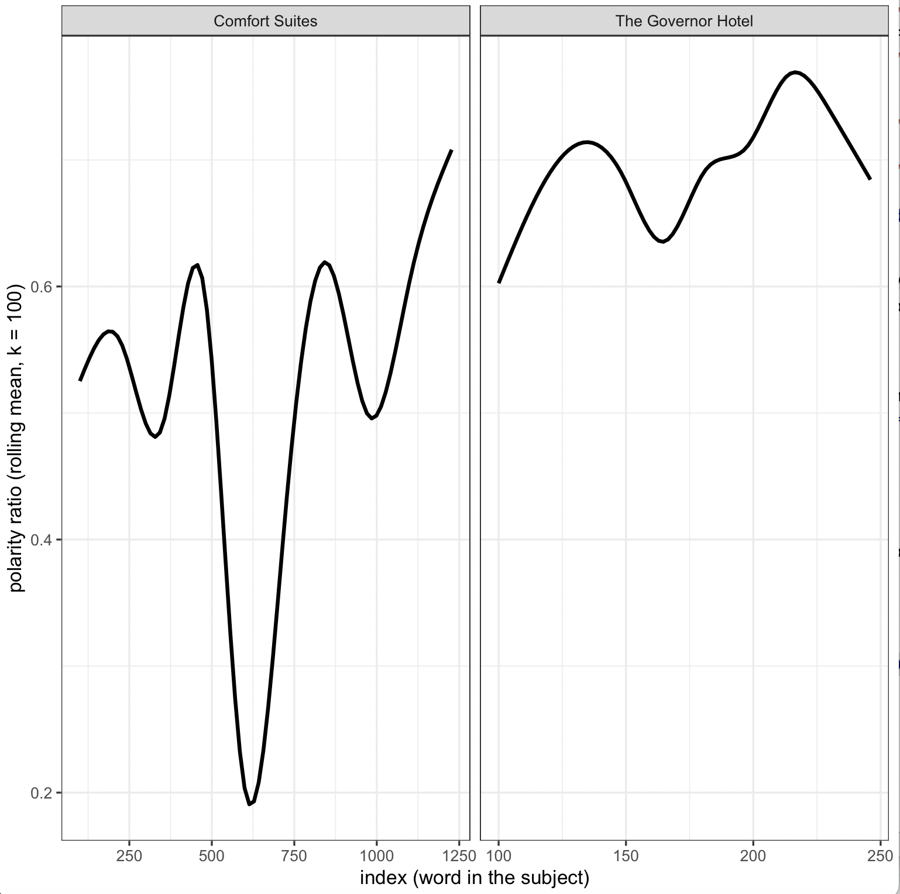

factcheckr Package
================
Armel Oum Maemble


  - [factcheckr: Sentiment Analysis](#factcheckr-Sentiment-Analysis)
  - [Installation](#installation)
  - [Usage](#usage)
  - [Getting started](#getting-started)
  - [Basic text functions for text manipulation](#basic-text-functions-for-text-manipulation)
  - [Data clean up: Package capability](#data-clean-up-package-capability)
  - [Create a subject annotations for all subjects](#create-a-subject-annotations-for-all-subjects)
  - [Data Visualization](#data-visualization)
  - [Viewing Sentiment Score](#viewing-sentiment-score)
  - [Word Frequency](#word-frequency)
  - [Emotion visualizations accross subjects](#emotion-visualizations-accross-subjects)
  - [Visualizing Emotion by subject](#visualizing-emotion-by-subject)
  - [Moving Average Plot](#moving-average-plot)
  - [WordCloud Visualization](#wordcloud-visualization)
  - [Questions and Support](#questions-and-support)

## factcheckr: Sentiment Analysis

This package provides utility functions for analyzing any text data including but not limited to functions for tokenizing text, topterms, word frequencies and sentiment analysis.

Sentiment Analysis involves discerning opinions expressed in various texts, categorizing them into different polarities such as positive, negative, or neutral. Also referred to as opinion mining and polarity detection, this process enables the identification of the underlying sentiment within documents, websites, social media feeds, political speeches, reviews and more. Sentiment Analysis is a form of classification, organizing data into distinct classes. These classes may take on a binary form, distinguishing between positive and negative sentiments, or they may encompass multiple categories, such as happy, sad, angry and so forth. 

This package aims to simplify the effort by providing a utility that can rapidly help mine text data such as reviews by saving time thousands of hours to readers and therefore allowing consumers to make informed decisions before committing to a product.

## Installation

``` r
devtools::install_github("smaemble/factcheckr")
```

## Usage

``` r
library(factcheckr)
```

## Getting started.
This package comes with two ready to use datasets which can serve as a basis to get an easy start. In this example, we will show a contrast between three different hotels. You can follow the same technique on any product, speech, etc....

### Basic text functions for text manipulation 
Break a text into words.
```r
> words = strtokwords("This is an example of how to tokenize text in R.")
> words
 [,1]      
 [1,] "this"    
 [2,] "is"      
 [3,] "an"      
 [4,] "example" 
 [5,] "of"      
 [6,] "how"     
 [7,] "to"      
 [8,] "tokenize"
 [9,] "text"    
[10,] "in"      
[11,] "r"
```

Breaking a text into sentences.
```r
> text <- "This is a very long character vector. Why is it so long? I think lng. is short for long. I want to split this vector into senteces by using e.g. strssplit. Can someone help me? That would be nice?"
> out <- strtoksentence(text)
> out
[1] "This is a very long character vector."
[2] "Why is it so long?"                          
[3] "I think lng. is short for long."                                    
[4] "I want to split this vector into senteces by using e.g. strssplit."
[5] "Can someone help me?"                                               
[6] "That would be nice?"
```

Other text manipulation functions include removing extra spaces from left, right, middle of the string such as
```r
>(trimTextl(" This   is  String  "))
>"This   is  String  "
>
>(trimTextr("  This   is  String")) 
>" This   is  String"
>
>(trimText(text))
>"This is String"
```

Sentiment Analysis using dataset provided

``` r
ComfortSuites <- createTestData(dataset=Hotel_Reviews, hotelName="Comfort Suites")
Motel6 <- createTestData(dataset=Hotel_Reviews, hotelName="Motel 6")
GovernorHotel <- createTestData(dataset=Hotel_Reviews, hotelName="The Governor Hotel")
```
The hotel names can be found in the Hotel_Reviews dataset. Use `unique(Hotel_Reviews$name)` script to view hotel names. This prep operation above extracts reviews for four different hotels namely Comfort Suites, Motel 6 and Governor Hotel and collapse them into a text(corpus) each. There are 879 different hotels in the Hotel_Reviews dataset and you can follow instructions above to extract any hotels review needed. The `createTestData()` function only works with this test dataset and is not part of this package capability. 

## Data clean up: Package capability
We are going to use the `neatlyStart()` function to clean up our text data. this function takes a corpus and subject then convert the corpus to lower case, then words, remove any extra spaces, remove stopwords as well as non English words and then create a new column called subject and return a tibble.

``` r
nsComfortSuites <- neatlyStart(corpus=ComfortSuites, subject="Comfort Suites")
nsMotel6 <- neatlyStart(corpus=Motel6, subject="Motel 6")
nsGovernorHotel <- neatlyStart(corpus=GovernorHotel, subject="The Governor Hotel")
```

## Create a subject annotations for all subjects

 Use the `combineSubjects()` function by passing a list of neatlyStart() function output using 03 of the lexicon `nrc`, `bing` or `loughran`. This function combines all 03 subjects at once so we can draw a contrast.
 
```r
nrcSubjects <- factcheckr::combineSubjects(list(nsComfortSuites, nsMotel6, nsGovernorHotel), lex="nrc")

# A tibble: 4,119 × 4
# Groups:   Subject [3]
   Word    Subject        words sentiment   
   <chr>   <fct>          <int> <fct>       
 1 medical Comfort Suites  5533 anticipation
 2 medical Comfort Suites  5533 fear        
 3 medical Comfort Suites  5533 positive    
 4 medical Comfort Suites  5533 trust       
 5 center  Comfort Suites  5533 positive    
 6 center  Comfort Suites  5533 trust       
 7 clean   Comfort Suites  5533 joy         
 8 clean   Comfort Suites  5533 positive    
 9 clean   Comfort Suites  5533 trust       
10 decent  Comfort Suites  5533 positive
# ℹ 4,109 more rows
```

Using bing lexicon gives a comparable results

```r
bingSubjects <- factcheckr::combineSubjects(list(nsComfortSuites, nsMotel6, nsGovernorHotel), lex="bing")
# A tibble: 1,533 × 4
# Groups:   Subject [3]
   Word           Subject        words sentiment
   <chr>          <fct>          <int> <fct>    
 1 clean          Comfort Suites  5533 positive 
 2 decent         Comfort Suites  5533 positive 
 3 negative       Comfort Suites  5533 negative 
 4 pathetic       Comfort Suites  5533 negative 
 5 discriminatory Comfort Suites  5533 negative 
 6 free           Comfort Suites  5533 positive 
 7 accessible     Comfort Suites  5533 positive 
 8 issue          Comfort Suites  5533 negative 
 9 unreasonable   Comfort Suites  5533 negative 
10 remedy         Comfort Suites  5533 positive 
# ℹ 1,523 more rows

```
## Data Visualization

Use `ggplot3(text=text, graphType = "frequency", top = 50, embs = FALSE, lexicon="nrc", maxWords = 50, cutoffScore=100)` function to view and analyze 07 graph types namely: `"frequency","sentiment", "emotion", "topterms", "movingaverage", "polarity", "wordcloud"`. The `lexicon` parameter can be `nrc`, `bing` and `loughran`. Words are classified based on the lexicon which contained known words. It is recommended to start with a lower cut off score or you may see an empty plot. Future releases will include suggestive cutoffScores.

## Viewing Sentiment Score
the text argument should be the output of the `neatlyStart` function
``` r
ggplot3(text=nsComfortSuites, graphType = "sentiment", lexicon="bing", cutoffScore = 4)
```
Sentiment Score plot for the Comfort suites Hotel


## Word Frequency
Graph below shows the most frequently used words in Motel6 aggregated Reviews. 
``` r
ggplot3(text=nsMotel6, graphType = "frequency")
```


The word `motel` appears a lot and it does not tell us anything about this motel since we are reviewing the motel itself. So `motel` is a stopword and you can use factcheckr `removeStopwords()` function to remove one or many stopwords as follows. 

``` r
nsMotel6 <- removeStopwords(words_dictionary= nsMotel6, stopwords = data.frame(word = c("motel")))
```

## Emotion visualizations accross subjects

To summarize the results of the Sentiment Analysis, the percentages of the prevalence of emotions across these hotels is calculated using `nrc` lexicon because it has multiclass classification with words such as `anger`, `anticipation`, `disgust`, `fear`, `joy`, `sadness`, `surprise` and `trust` while `bing` lexicon classfies only as `positive` or `negative`.

Use `emotionFrequency()` passing `nrcSubjects` obtained above. Then pass that result to the `ggplot3()` to visualize the contrast amongst the subjects under fact checking. 

```r
nrcEmotions <- emotionFrequency(subjectsAnnotations=nrcSubjects)
ggplot3(text=nrcEmotions, graphType ="emotion")
```


### Visualizing Emotion by subject

You must pass the `embs=TRUE` parameter to change the plot.

```r
ggplot3(text=emotionFrequency(subjectsAnnotations=nrcSubjects), embs=TRUE, graphType ="emotion")
```


We can also examine the words that have influenced the emotionality scores. In simpler terms, we explore which words carry the most significance for the emotion scores within each hotel or subject. To enhance interpretability, we will exclude specific core emotion categories as well as polarity.

```r
topwords <- topterms(nrcSubjects)

# A tibble: 61 × 5
# Groups:   Subject, sentiment [12]
   Subject            Word     sentiment     n score
   <fct>              <chr>    <fct>     <int> <dbl>
 1 Comfort Suites     clean    trust       117 0.476
 2 Comfort Suites     clean    joy         117 0.476
 3 Comfort Suites     friendly trust        68 0.276
 4 Comfort Suites     friendly joy          68 0.276
 5 Comfort Suites     helpful  trust        35 0.142
 6 Comfort Suites     helpful  joy          35 0.142
 7 Comfort Suites     comfort  trust        26 0.106
 8 Comfort Suites     comfort  joy          26 0.106
 9 Comfort Suites     hot      anger        21 0.412
10 The Governor Hotel deal     trust        12 0.333
# ℹ 51 more rows
```

The plot as 
```r
ggplot3(text = topterms(nrcSubjects), graphType ="topterms")
```


## Moving Average Plot
The moving average plot tells us how opinions are changing overtime
``` r
ggplot3(text=polarityChange(nrcSubjects), graphType="movingaverage")
```




## WordCloud Visualization. 
For the ultimate visualization, we'll generate a word cloud that highlights the most frequently occurring positive and negative words. Specifically, we'll utilize the `ggplot3()` function to craft a single word cloud encompassing both negative and positive words, presenting a comprehensive view.
```r
ggplot3(text=nsGovernorHotel, graphType = "wordcloud", lexicon="bing", maxWords = 100)
```
The Governor Hotel Wordcloud which shows a big disappointment


## Questions and Support

Contact the Maintainer via LinkedIn https://www.linkedin.com/in/armel-oum-maemble/
